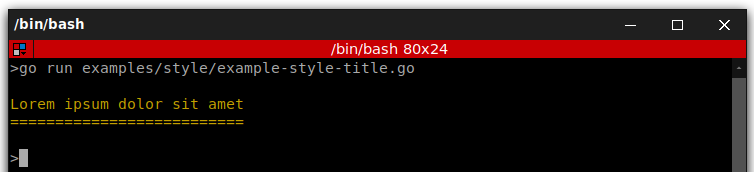
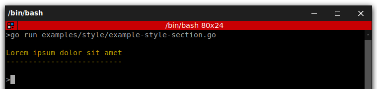
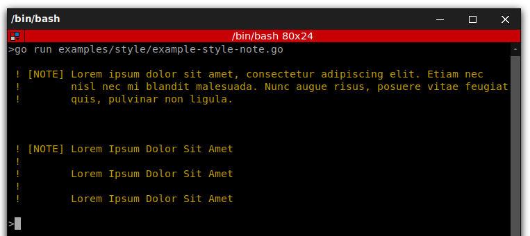
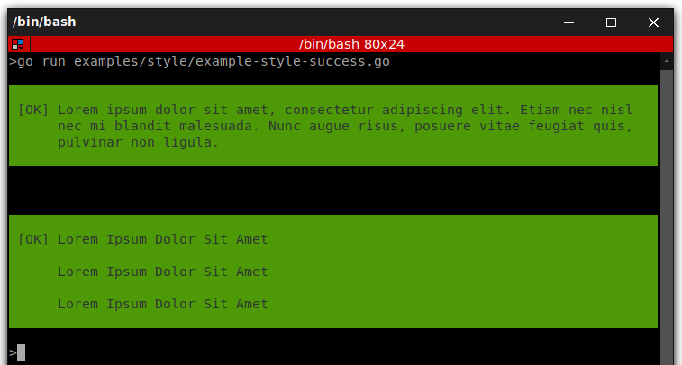
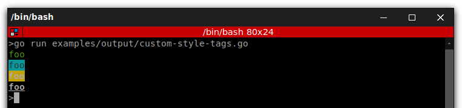
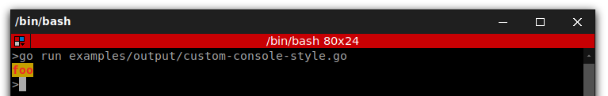
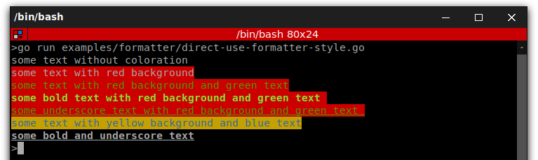

<p align="center">
    
</p>

# How to Style a Console Command

[](https://circleci.com/gh/DrSmithFr/go-console)
[](https://golangci.com/r/github.com/DrSmithFr/go-console)
[](https://goreportcard.com/report/github.com/DrSmithFr/go-console)

One of the most boring tasks when creating console commands is to deal with the styling of the command's output, 
this library provide several helper for that. 

GoConsole is a lightweight equivalent in Go to the [Console Component](https://github.com/symfony/console) of Symfony PHP framework.

## How to Style the Console Output

### Basic Usage

```go
package main

import (
	"github.com/DrSmithFr/go-console/pkg/output"
	"github.com/DrSmithFr/go-console/pkg/style"
)

func main() {
	// create default console styler
	io := style.NewConsoleGoStyler()
	
	// or create styler with custom OutputInterface
	out := output.NewConsoleOutput(true, nil)
	io := style.NewGoStyler(out)

	// add title
	io.Title("Lorem Ipsum Dolor Sit Amet")
	
	// you still access the OutputInterface
    io.GetOutput().Write("<info>some info</>")
}
```

### Helper Methods

#### Titling Methods

##### title()

It displays the given string as the command title. This method is meant to be used only once in a given command, but nothing prevents you to use it repeatedly:

```go
io.Title("Lorem Ipsum Dolor Sit Amet")
```

<p align="center">
    
</p>

##### section()

It displays the given string as the title of some command section. This is only needed in complex commands which want to better separate their contents:

```go
io.Section("Lorem Ipsum Dolor Sit Amet")
```

<p align="center">
    
</p>

#### Content Methods

##### text()

It displays the given string or array of strings as regular text. This is useful to render help messages and instructions for the user running the command:

```go
// use simple strings for short messages
io.Text("Lorem Ipsum Dolor Sit Amet, [...]")

// consider using arrays when displaying long messages
io.TextArray([]string{
	"Lorem Ipsum Dolor Sit Amet",
	"Lorem Ipsum Dolor Sit Amet",
	"Lorem Ipsum Dolor Sit Amet",
})
```

<p align="center">
    
</p>

##### listing()

It displays an unordered list of elements passed as an array:

```go
io.Listing([]string{
	"Lorem Ipsum Dolor Sit Amet",
	"Lorem Ipsum Dolor Sit Amet",
	"Lorem Ipsum Dolor Sit Amet",
})
```

<p align="center">
    
</p>

##### newLine()

It displays a blank line in the command output. Although it may seem useful, most of the times you won't need it at all. The reason is that every helper already adds their own blank lines, so you don't have to care about the vertical spacing:

```go
// outputs a single blank line
io.NewLine(1)

// outputs three consecutive blank lines
io.NewLine(3)
```

#### Admonition Methods

##### note()

It displays the given string or array of strings as a highlighted admonition. Use this helper sparingly to avoid cluttering command's output:

```go
// use simple strings for short messages
io.Note("Lorem Ipsum Dolor Sit Amet, [...]")

// consider using arrays when displaying long messages
io.NoteArray([]string{
	"Lorem Ipsum Dolor Sit Amet",
	"Lorem Ipsum Dolor Sit Amet",
	"Lorem Ipsum Dolor Sit Amet",
})
```

<p align="center">
    
</p>

##### caution()

Similar to the note() helper, but the contents are more prominently highlighted. The resulting contents resemble an error message, so you should avoid using this helper unless strictly necessary:

```go
// use simple strings for short messages
io.Caution("Lorem Ipsum Dolor Sit Amet, [...]")

// consider using arrays when displaying long messages
io.CautionArray([]string{
	"Lorem Ipsum Dolor Sit Amet",
	"Lorem Ipsum Dolor Sit Amet",
	"Lorem Ipsum Dolor Sit Amet",
})
```

<p align="center">
    
</p>

#### Result Methods

##### success()

It displays the given string or array of strings highlighted as a successful message (with a green background and the \[OK] label). It's meant to be used once to display the final result of executing the given command, but you can use it repeatedly during the execution of the command:

```go
// use simple strings for short messages
io.Success("Lorem Ipsum Dolor Sit Amet, [...]")

// consider using arrays when displaying long messages
io.SuccessArray([]string{
	"Lorem Ipsum Dolor Sit Amet",
	"Lorem Ipsum Dolor Sit Amet",
	"Lorem Ipsum Dolor Sit Amet",
})
```

<p align="center">
    
</p>

##### warning()

It displays the given string or array of strings highlighted as a warning message (with a red background and the \[WARNING] label). It's meant to be used once to display the final result of executing the given command, but you can use it repeatedly during the execution of the command:

```go
// use simple strings for short messages
io.Warning("Lorem Ipsum Dolor Sit Amet, [...]")

// consider using arrays when displaying long messages
io.WarningArray([]string{
	"Lorem Ipsum Dolor Sit Amet",
	"Lorem Ipsum Dolor Sit Amet",
	"Lorem Ipsum Dolor Sit Amet",
})
```

<p align="center">
    
</p>

##### error()

It displays the given string or array of strings highlighted as an error message (with a red background and the \[ERROR] label). It's meant to be used once to display the final result of executing the given command, but you can use it repeatedly during the execution of the command:

```go
// use simple strings for short messages
io.Error("Lorem Ipsum Dolor Sit Amet, [...]")

// consider using arrays when displaying long messages
io.ErrorArray([]string{
	"Lorem Ipsum Dolor Sit Amet",
	"Lorem Ipsum Dolor Sit Amet",
	"Lorem Ipsum Dolor Sit Amet",
})
```

<p align="center">
    
</p>

## How to Color the Console Output

Whenever you output text, you can use OutputInterface to surround the text with tags to color its output. For example:

```go
package main

import "github.com/DrSmithFr/go-console/pkg/output"

func main() {
    // creating new output
    out := output.NewConsoleOutput(true, nil)
    
    // white text on a red background
    out.Writeln("<error>An error</error>")
    
    // green text
    out.Writeln("<info>An information</info>")
    
    // yellow text
    out.Writeln("<comment>An comment</comment>")
    
    // black text on a cyan background
    out.Writeln("<question>A question</question>")
    
    // underscore text
    out.Writeln("<u>Some underscore text</u>")
    
    // bold text
    out.Writeln("<b>Some bold text</b>")
}
```

<p align="center">
    
</p>

> The closing tag can be replaced by </>, which revokes all formatting options established by the last opened tag.

---

You can also set these colors and options directly inside the tag name:

```go
package main

import "github.com/DrSmithFr/go-console/pkg/output"

func main() {
    // green text
    out := output.NewConsoleOutput(true, nil)
    
    // black text on a cyan background
    out.Writeln("<fg=green>foo</>")
    
    // green text
    out.Writeln("<fg=black;bg=cyan>foo</>")
    
    // bold text on a yellow background
    out.Writeln("<bg=yellow;options=bold>foo</>")
    
    // bold text with underscore
    out.Writeln("<options=bold,underscore>foo</>")
}
```

<p align="center">
    
</p>

> If you need to render a tag literally, escape it with a backslash: \<info> or use the escape() method to escape all the tags included in the given string.

---

It is possible to define your own styles using the OutputFormatterStyle

```go
package main

import (
	"github.com/DrSmithFr/go-console/pkg/color"
	"github.com/DrSmithFr/go-console/pkg/formatter"
	"github.com/DrSmithFr/go-console/pkg/output"
)

func main() {
	// creating new output
	out := output.NewConsoleOutput(true, nil)

	// create new style
	s := formatter.NewOutputFormatterStyle(color.RED, color.YELLOW, []string{color.BOLD, color.BLINK})

	// add style to formatter
	out.GetFormatter().SetStyle("fire", *s)

	// use the new style
	out.Writeln("<fire>foo</>")
}
```

<p align="center">
    
</p>

> Available foreground and background colors are: black, red, green, yellow, blue, magenta, cyan and white.
> And available options are: bold, underscore, blink, reverse (enables the "reverse video" mode where the background and foreground colors are swapped) and conceal (sets the foreground color to transparent, making the typed text invisible - although it can be selected and copied; this option is commonly used when asking the user to type sensitive information).

---

By using colors in the command output, you can distinguish different types of output (e.g. important messages, titles, comments, etc.).

```go
package main

import (
	"fmt"
	"github.com/DrSmithFr/go-console/pkg/color"
	"github.com/DrSmithFr/go-console/pkg/formatter"
)

func main() {
	// create a default style
	s1 := formatter.NewOutputFormatterStyle(color.NULL, color.NULL, nil)
	fmt.Printf(s1.Apply("some text without coloration\n"))

	s1.SetBackground(color.RED)
	fmt.Printf(s1.Apply("some text with red background\n"))

	s1.SetForeground(color.GREEN)
	fmt.Printf(s1.Apply("some text with red background and green text\n"))

	s1.SetOption(color.BOLD)
	fmt.Printf(s1.Apply("some bold text with red background and green text \n"))

	// override all options in one time
	s1.SetOptions([]string{color.UNDERSCORE})
	fmt.Printf(s1.Apply("some underscore text with red background and green text \n"))

	// quick declaration
	s2 := formatter.NewOutputFormatterStyle(color.BLUE, color.YELLOW, nil)
	fmt.Printf(s2.Apply("some text with yellow background and blue text\n"))

	// quick declaration with options
	s3 := formatter.NewOutputFormatterStyle(color.DEFAULT, color.DEFAULT, []string{color.UNDERSCORE, color.BOLD})
	fmt.Printf(s3.Apply("some bold and underscore text\n"))
}
```

<p align="center">
    
</p>

> The OutputFormatterStyle is the simplest way to color output. It is not mean to be use directly, but to defined custom tags used by OutputFormatterInterface.
