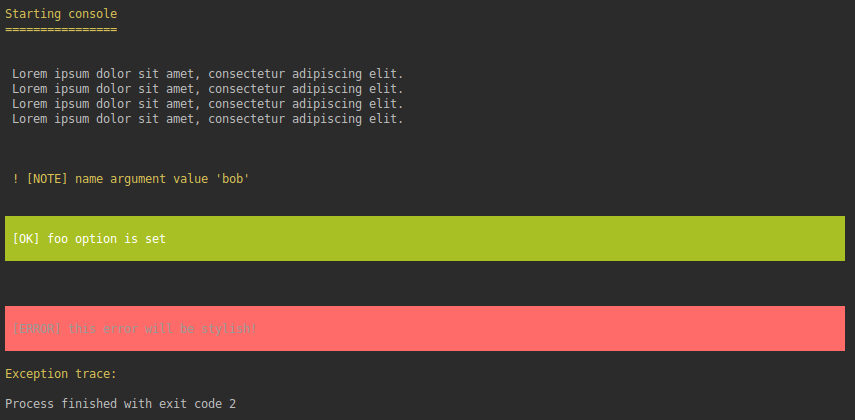

<p align="center">
    
</p>

# The Go console component

[](https://circleci.com/gh/DrSmithFr/go-console)
[](https://golangci.com/r/github.com/DrSmithFr/go-console)
[](https://goreportcard.com/report/github.com/DrSmithFr/go-console)

> The Console component eases the creation of beautiful and testable command line interfaces.

GoConsole component allows you to create command-line commands. Your console commands can be used for any recurring task, such as cronjobs, imports, or other batch jobs.
Command arguments and options follow the [docopt standard](http://docopt.org/). This library provide several helper for styling of the command's output.

GoConsole is a lightweight equivalent in Go to the [Console Component](https://github.com/symfony/console) of Symfony PHP framework.

## Creating a Console Application

```go
package main

import (
    "fmt"
    "github.com/DrSmithFr/go-console/pkg/input/argument"
    "github.com/DrSmithFr/go-console/pkg/input/option"
    "github.com/DrSmithFr/go-console/pkg/style"
)

func main() {
    io := style.
        NewConsoleStyler().
        AddInputArgument(
            argument.
                New("name", argument.REQUIRED),
        ).
        AddInputOption(
            option.
                New("foo", option.NONE).
                SetShortcut("f"),
        ).
        ParseInput().
        ValidateInput()

    //
    // Do what you want with console and args !
    //

    io.Title("Starting console")

    io.TextArray([]string{
        "Lorem ipsum dolor sit amet, consectetur adipiscing elit.",
        "Lorem ipsum dolor sit amet, consectetur adipiscing elit.",
        "Lorem ipsum dolor sit amet, consectetur adipiscing elit.",
        "Lorem ipsum dolor sit amet, consectetur adipiscing elit.",
    })

    io.Note(
        fmt.Sprintf(
            "name argument value '%s'",
            io.GetInput().GetArgument("name"),
        ),
    )

    if option.DEFINED == io.GetInput().GetOption("foo") {
        io.Success("foo option is set")
    } else {
        io.Error("foo option is set")
    }
}
```

<p align="center">
    
</p>

## Learn more
- [How to use input options and arguments](docs/console-input.md)
- [How to style the console output](docs/console-output.md)
