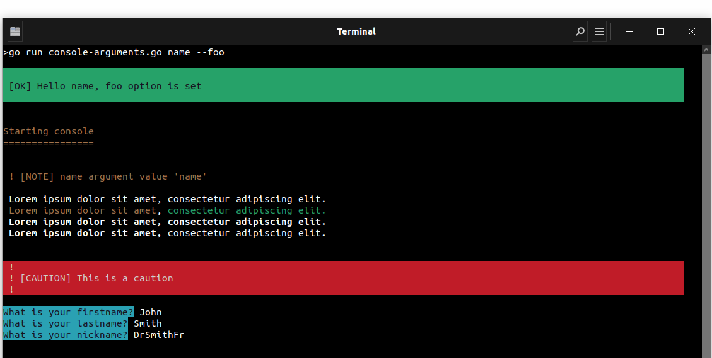
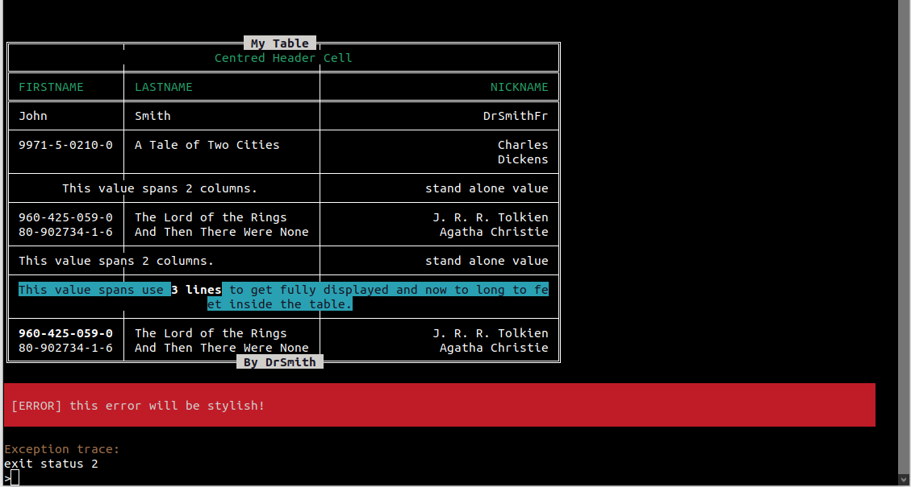

<p align="center">
    
</p>

# The Go console component

[](https://circleci.com/gh/github.com/DrSmithFr/go-console)
[](https://goreportcard.com/report/github.com/github.com/DrSmithFr/go-console)

> The Console component eases the creation of beautiful and testable command line interfaces.

GoConsole component allows you to create command-line commands. Your console commands can be used for any recurring task, such as cronjobs, imports, or other batch jobs.
Command arguments and options follow the [docopt standard](http://docopt.org/). This library provide several helper for styling of the command's output.

GoConsole is a lightweight equivalent in Go to the [Console Component 3.4](https://github.com/symfony/console/tree/3.4) of Symfony PHP framework.

## Creating a Console Application

```go
package main

import (
	"errors"
	"fmt"
	"github.com/DrSmithFr/go-console/pkg/input/argument"
	"github.com/DrSmithFr/go-console/pkg/input/option"
	"github.com/DrSmithFr/go-console/pkg/question"
	"github.com/DrSmithFr/go-console/pkg/style"
	"github.com/DrSmithFr/go-console/pkg/table"
	"golang.org/x/text/cases"
	"golang.org/x/text/language"
	"os"
	"regexp"
)

func main() {

	//
	// Easy way to create a command with arguments and options
	//

	io := style.
		NewConsoleCommand().
		AddInputArgument(
			argument.
				New("name", argument.REQUIRED),
		).
		AddInputOption(
			option.
				New("foo", option.NONE).
				SetShortcut("f"),
		).
		Build()

	name := io.GetInput().GetArgument("name")

	if option.DEFINED == io.GetInput().GetOption("foo") {
		io.Success(fmt.Sprintf("Hello %s, foo option is set", name))
	} else {
		io.Warning(fmt.Sprintf("Hello %s, foo option not set", name))
	}

	//
	// Easy way to style your program
	//

	io.Title("Starting console")

	io.Note(
		fmt.Sprintf(
			"name argument value '%s'",
			io.GetInput().GetArgument("name"),
		),
	)

	io.TextArray([]string{
		"Lorem ipsum dolor sit amet, consectetur adipiscing elit.",
		"<comment>Lorem ipsum dolor sit amet</comment>, <info>consectetur adipiscing elit.</info>",
		"<b>Lorem ipsum dolor sit amet, consectetur adipiscing elit.</b>",
		"<b>Lorem ipsum dolor sit amet, <u>consectetur adipiscing elit</u>.</b>",
	})

	io.Caution("This is a caution")

	//
	// Easy User Interaction
	//

	qh := question.NewHelper(os.Stdin, io.GetOutput())

	// Simple question with default answer
	firstname := qh.Ask(
		question.
			NewQuestion("What is your firstname?").
			SetDefaultAnswer("Doe"),
	)

	// Simple question with normalizer
	lastname := qh.Ask(
		question.
			NewQuestion("What is your lastname?").
			SetNormalizer(func(answer string) string {
				return cases.Title(language.English, cases.Compact).String(answer)
			}),
	)

	// Simple question with custom validator
	nickname := qh.Ask(
		question.
			NewQuestion("What is your nickname?").
			SetValidator(func(answer string) error {
				regex := regexp.MustCompile("^(\\w|_|-)*$")
				if match := regex.MatchString(answer); !match {
					return errors.New("nickname must be alphanumeric")
				}

				return nil
			}),
	)

	io.TextArray([]string{
		" ",
		" ",
		" ",
	})

	//
	// Render a tables
	//

	tab := table.
		NewTable().
		SetHeaderTitle("My Table").
		SetFooterTitle("By DrSmith").
		SetColumnPadding(3, table.PadToRight).
		AddHeader(
			&table.TableRow{
				Columns: map[int]table.TableColumnInterface{
					0: &table.TableColumn{
						Cell: &table.TableCell{
							Value:   "Centred Header Cell",
							Colspan: 3,
							PadType: table.PadToCenter,
						},
					},
				},
			},
		).
		AddHeadersFromString(
			[][]string{
				{"==="},
				{"FIRSTNAME", "LASTNAME", "NICKNAME"},
			},
		)

	tab.
		AddRowsFromString(
			[][]string{
				{firstname, lastname, nickname},
				{"---"}, // shortcut for TableSeparator
				{"9971-5-0210-0", "A Tale of Two Cities", "Charles\nDickens"},
			},
		).
		AddTableSeparator().
		AddRow(
			table.
				NewTableRow().
				AddColumn(
					table.
						NewTableColumn().
						SetCell(
							table.
								NewTableCell("This value spans 2 columns.").
								SetPadType(table.PadToCenter).
								SetColspan(2),
						),
				).
				AddColumn(
					table.
						NewTableColumn().
						SetCell(
							table.
								NewTableCell("stand alone value"),
						),
				),
		).
		AddTableSeparator().
		AddRowsFromString(
			[][]string{
				{"960-425-059-0", "The Lord of the Rings", "J. R. R. Tolkien"},
				{"80-902734-1-6", "And Then There Were None", "Agatha Christie"},
			},
		)

	tab.
		AddTableSeparator().
		AddRow(
			table.
				NewTableRow().
				AddColumn(
					table.
						NewTableColumn().
						SetCell(
							table.
								NewTableCell("This value spans 2 columns.").
								SetColspan(2),
						),
				).
				AddColumn(
					table.
						NewTableColumn().
						SetCell(
							table.
								NewTableCell("stand alone value"),
						),
				),
		)

	tab.
		AddTableSeparator().
		AddRow(
			&table.TableRow{
				Columns: map[int]table.TableColumnInterface{
					0: &table.TableColumn{
						Cell: &table.TableCell{
							Value:   "<question>This value spans use <b>3 lines</b> to get fully displayed and now to long to feet inside the table.</question>",
							Colspan: 3,
							PadType: table.PadToCenter,
						},
					},
				},
			},
		)

	tab.
		AddTableSeparator().
		AddRowsFromString(
			[][]string{
				{"<b>960-425-059-0</b>", "The Lord of the Rings", "J. R. R. Tolkien"},
				{"80-902734-1-6", "And Then There Were None", "Agatha Christie"},
			},
		)

	render := table.
		NewRender(io.GetOutput()).
		SetContent(tab)

	render.SetColumnsMinWidths(map[int]int{
		0: 10,
		1: 0,
		2: 30,
	})

	render.SetStyleFromName("box-double")
	render.Render()

	//
	// enable stylish errors on need
	//

	defer io.HandleRuntimeException()
	panic("this error will be stylish!")
}
```

<p align="center">
    
</p>

<p align="center">
    
</p>

## Learn more
- [How to use input options and arguments](docs/console-input.md)
- [How to style the console output](docs/console-output.md)
- [How to use verbosity levels](docs/console-verbosity.md)
- [How to ask for user input](docs/console-question.md)
- [How to display tables in the console](docs/console-table.md)