<p align="center">
    
</p>

# The Go console component

[](https://circleci.com/gh/github.com/DrSmithFr/go-console)
[](https://goreportcard.com/report/github.com/github.com/DrSmithFr/go-console)

> The Console component eases the creation of beautiful and testable command line interfaces.

GoConsole component allows you to create command-line commands. Your console commands can be used for any recurring
task, such as cronjobs, imports, or other batch jobs.
Command arguments and options follow the [docopt standard](http://docopt.org/). This library provide several helper for
styling of the command's output.

GoConsole is a lightweight equivalent in Go to the [Console Component 3.4](https://github.com/symfony/console/tree/3.4)
of Symfony PHP framework.

## Tables of Contents
* [How to use input options and arguments](#how-to-use-input-options-and-arguments)
  * [Console Input (Arguments & Options)](#console-input)
    * [Using Command Arguments](#using-command-arguments)
    * [Using Command Options](#using-command-options)
---
 * [How to style the console output](#how-to-style-the-console-output)
  * [Helper Methods](#helper-methods)
    * [Titling Methods](#titling-methods)
    * [Content Methods](#content-methods)
    * [Admonition Methods](#admonition-methods)
    * [Result Methods](#result-methods)
---
 * [How to Color the Console Output](#how-to-color-the-console-output)
    * [Predefined style tag](#predefined-style-tags)
    * [Generic style tags](#generic-style-tags)
    * [Custom color tag](#custom-color-tags)
---
* [How to use verbosity levels](#how-to-use-verbosity-levels)
---
* [How to ask for user input](#how-to-ask-for-user-input)
  * [Asking the User for Information](#asking-the-user-for-information)
  * [Hiding the User's Response](#hiding-the-users-response)
  * [Asking the User for Confirmation](#asking-the-user-for-confirmation)
  * [Asking the User for a Choice](#asking-the-user-for-a-choice)
  * [Multiple Choices](#multiple-choices)
  * [Normalizing the Answer](#normalizing-the-answer)
  * [Validating the Answer](#validating-the-answer)
---
* [How to display tables in the console](#how-to-display-tables-in-the-console)
  * [Table Styling](#table-styling)
  * [Table Styling](#table-styling)
  * [Padding management](#padding-management)
---

# How to use input options and arguments

## Console Input

The most interesting part of the commands are the arguments and options that you can make available. These arguments and
options allow you to pass dynamic information from the terminal to the command.

### Using Command Arguments

Arguments are the strings - separated by spaces - that come after the command name itself. They are ordered, and can be
optional or required. For example, to add an optional `last_name` argument to the command and make the `name` argument
required:

```go
package main

import (
	"fmt"
	"github.com/DrSmithFr/go-console/pkg/input/argument"
	"github.com/DrSmithFr/go-console/pkg/style"
)

func main() {
	io := style.
		NewConsoleCommand().
		AddInputArgument(
			argument.
				New("name", argument.REQUIRED).
				SetDescription("Who do you want to greet?"),
		).
		AddInputArgument(
			argument.
				New("last_name", argument.OPTIONAL).
				SetDescription("Your last name?"),
		).
		Build()

	//
	// You now have access to a last_name argument in your command:
	//

	text := fmt.Sprintf("Hi %s", io.GetInput().GetArgument("name"))

	lastName := io.GetInput().GetArgument("last_name")

	if lastName != "" {
		text = fmt.Sprintf("%s %s", text, lastName)
	}

	io.GetOutput().Write(text)
	io.GetOutput().Writeln("!")
}
```

The command can now be used in either of the following ways:

```
go run command-script John
> Hi John!

go run command John Smith
> Hi John Daligault!
```

---

It is also possible to let an argument take a list of values (imagine you want to greet all your friends). Only the last
argument can be a list:

```go
package main

import (
	"fmt"
	"github.com/DrSmithFr/go-console/pkg/input/argument"
	"github.com/DrSmithFr/go-console/pkg/style"
)

func main() {
	io := style.
		NewConsoleCommand().
		AddInputArgument(
			argument.
				New("names", argument.IS_ARRAY).
				SetDescription("Who do you want to greet?"),
		).
		Build()

	//
	// You can access the names argument as an array:
	//

	names := io.GetInput().GetArgumentArray("names")

	for _, name := range names {
		io.Text(fmt.Sprintf("Hi %s!", name))
	}
}
```

To use this, specify as many names as you want:

```go
go run command-script John Alex Fred
```

---

There are three argument variants you can use:

`argument.REQUIRED`
> The argument is mandatory. The command doesn't run if the argument isn't provided;

`argument.OPTIONAL`
> The argument is optional and therefore can be omitted. This is the default behavior of arguments;

`argument.IS_ARRAY`
> The argument can contain any number of values. For that reason, it must be used at the end of the argument list.

You can combine `IS_ARRAY` with `REQUIRED` and `OPTIONAL` like this:

```go
io := style.
NewConsoleCommand().
AddInputArgument(
argument.
New("names", argument.IS_ARRAY | argument.REQUIRED),
).
ParseInput().
ValidateInput()
```

### Using Command Options

Unlike arguments, options are not ordered (meaning you can specify them in any order) and are specified with two
dashes (e.g. `--yell`). Options are always optional, and can be setup to accept a value (e.g. `--dir=src`) or as a
boolean flag without a value (e.g.  `--yell`).

For example, add a new option to the command that can be used to specify how many times in a row the message should be
printed:

```go
package main

import (
	"fmt"
	"github.com/DrSmithFr/go-console/pkg/input/argument"
	"github.com/DrSmithFr/go-console/pkg/input/option"
	"github.com/DrSmithFr/go-console/pkg/style"
	"strconv"
)

func main() {
	io := style.
		NewConsoleCommand().
		AddInputArgument(
			argument.
				New("name", argument.REQUIRED).
				SetDescription("Who do you want to greet?"),
		).
		AddInputOption(
			option.
				New("iterations", option.REQUIRED).
				SetDescription("How many times should the message be printed?").
				SetDefault("1"),
		).
		Build()

	//
	// Next, use this in the command to print the message multiple times:
	//

	iterations, _ := strconv.Atoi(io.GetInput().GetOption("iterations"))

	for i := 0; i < iterations; i++ {
		io.Text(
			fmt.Sprintf("Hi %s!", io.GetInput().GetArgument("name")),
		)
	}
}
```

Now, when you run the command, you can optionally specify a `--iterations` flag:

```
# no --iterations provided, the default (1) is used
$ php bin/console app:greet John
 Hi John!

$ php bin/console app:greet John --iterations=5
 Hi John!
 Hi John!
 Hi John!
 Hi John!
 Hi John!


$ php bin/console app:greet John --iterations=5 --yell
$ php bin/console app:greet John --yell --iterations=5
$ php bin/console app:greet --yell --iterations=5 John
```

---

You can also declare a one-letter shortcut that you can call with a single dash, like `-i`:

```go
io := style.
NewConsoleCommand().
AddInputOption(
option.
New("iterations", option.REQUIRED).
SetShortcut("i"),
).
ParseInput().
ValidateInput()
```

Note that to comply with the [docopt standard](http://docopt.org/), long options can specify their values after a white
space or an = sign (e.g. `--iterations 5` or `--iterations=5`), but short options can only use white spaces or no
separation at all (e.g. `-i 5` or `-i5`).

> While it is possible to separate an option from its value with a white space, using this form leads to an ambiguity
> should the option appear before the command name.
> For example, `php bin/console --iterations 5 app:greet Fabien` is ambiguous; Go-console would interpret 5 as the
> command name. To avoid this situation, always place options after the command name, or avoid using a space to separate
> the option name from its value.

---

There are four option variants you can use:

`option.IS_ARRAY`
> This option accepts multiple values (e.g. `--dir=/foo --dir=/bar`);

`argument.NONE`
> Do not accept input for this option (e.g. `--yell`). This is the default behavior of options;

`argument.REQUIRED`
> This value is required (e.g. `--iterations=5` or `-i5`), the option itself is still optional;

`argument.OPTIONAL`
> This option may or may not have a value (e.g. `--yell` or `--yell=loud`).

You can combine `IS_ARRAY` with `REQUIRED` and `OPTIONAL` like this:

```go
io := style.
NewConsoleCommand().
AddInputOption(
option.New("iterations", option.IS_ARRAY | option.REQUIRED),
).
ParseInput().
ValidateInput()
```

---

[Return to Table of content](#tables-of-contents)

---

# How to Style the Console Output

One of the most boring tasks when creating console commands is to deal with the styling of the command's output, this
library provide several helper for that.

```go
package main

import (
	"github.com/DrSmithFr/go-console/pkg/input"
	"github.com/DrSmithFr/go-console/pkg/output"
	"github.com/DrSmithFr/go-console/pkg/style"
)

func main() {
	// create default console styler
	io := style.NewConsoleCommand()

	// or create styler with custom OutputInterface
	in := input.NewArgvInput(nil)
	out := output.NewConsoleOutput(true, nil)
	io := style.NewCommandStyler(in, out)

	// add title
	io.Title("Lorem Ipsum Dolor Sit Amet")

	// you still access the OutputInterface
	io.GetOutput().Write("<info>some info</>")
}
```

## Helper Methods

### Titling Methods

#### title()

It displays the given string as the command title. This method is meant to be used only once in a given command, but
nothing prevents you to use it repeatedly:

```go
io.Title("Lorem Ipsum Dolor Sit Amet")
```

<p align="center">
    
</p>

#### section()

It displays the given string as the title of some command section. This is only needed in complex commands which want to
better separate their contents:

```go
io.Section("Lorem Ipsum Dolor Sit Amet")
```

<p align="center">
    
</p>

### Content Methods

#### text()

It displays the given string or array of strings as regular text. This is useful to render help messages and
instructions for the user running the command:

```go
// use simple strings for short messages
io.Text("Lorem Ipsum Dolor Sit Amet, [...]")

// consider using arrays when displaying long messages
io.TextArray([]string{
"Lorem Ipsum Dolor Sit Amet",
"Lorem Ipsum Dolor Sit Amet",
"Lorem Ipsum Dolor Sit Amet",
})
```

<p align="center">
    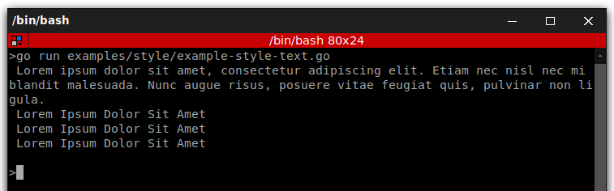
</p>

#### listing()

It displays an unordered list of elements passed as an array:

```go
io.Listing([]string{
"Lorem Ipsum Dolor Sit Amet",
"Lorem Ipsum Dolor Sit Amet",
"Lorem Ipsum Dolor Sit Amet",
})
```

<p align="center">
    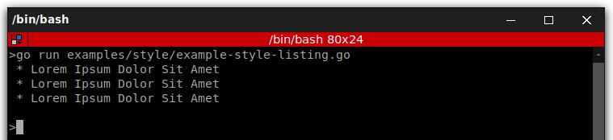
</p>

#### newLine()

It displays a blank line in the command output. Although it may seem useful, most of the times you won't need it at all.
The reason is that every helper already adds their own blank lines, so you don't have to care about the vertical
spacing:

```go
// outputs a single blank line
io.NewLine(1)

// outputs three consecutive blank lines
io.NewLine(3)
```

### Admonition Methods

#### note()

It displays the given string or array of strings as a highlighted admonition. Use this helper sparingly to avoid
cluttering command's output:

```go
// use simple strings for short messages
io.Note("Lorem Ipsum Dolor Sit Amet, [...]")

// consider using arrays when displaying long messages
io.NoteArray([]string{
"Lorem Ipsum Dolor Sit Amet",
"Lorem Ipsum Dolor Sit Amet",
"Lorem Ipsum Dolor Sit Amet",
})
```

<p align="center">
    
</p>

#### caution()

Similar to the note() helper, but the contents are more prominently highlighted. The resulting contents resemble an
error message, so you should avoid using this helper unless strictly necessary:

```go
// use simple strings for short messages
io.Caution("Lorem Ipsum Dolor Sit Amet, [...]")

// consider using arrays when displaying long messages
io.CautionArray([]string{
"Lorem Ipsum Dolor Sit Amet",
"Lorem Ipsum Dolor Sit Amet",
"Lorem Ipsum Dolor Sit Amet",
})
```

<p align="center">
    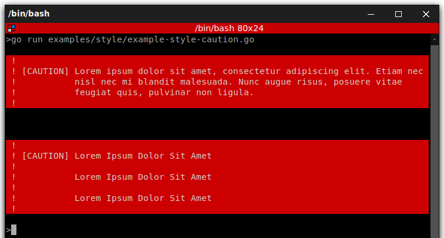
</p>

### Result Methods

#### success()

It displays the given string or array of strings highlighted as a successful message (with a green background and the
\[OK] label). It's meant to be used once to display the final result of executing the given command, but you can use it
repeatedly during the execution of the command:

```go
// use simple strings for short messages
io.Success("Lorem Ipsum Dolor Sit Amet, [...]")

// consider using arrays when displaying long messages
io.SuccessArray([]string{
"Lorem Ipsum Dolor Sit Amet",
"Lorem Ipsum Dolor Sit Amet",
"Lorem Ipsum Dolor Sit Amet",
})
```

<p align="center">
    
</p>

#### warning()

It displays the given string or array of strings highlighted as a warning message (with a red background and the
\[WARNING] label). It's meant to be used once to display the final result of executing the given command, but you can
use it repeatedly during the execution of the command:

```go
// use simple strings for short messages
io.Warning("Lorem Ipsum Dolor Sit Amet, [...]")

// consider using arrays when displaying long messages
io.WarningArray([]string{
"Lorem Ipsum Dolor Sit Amet",
"Lorem Ipsum Dolor Sit Amet",
"Lorem Ipsum Dolor Sit Amet",
})
```

<p align="center">
    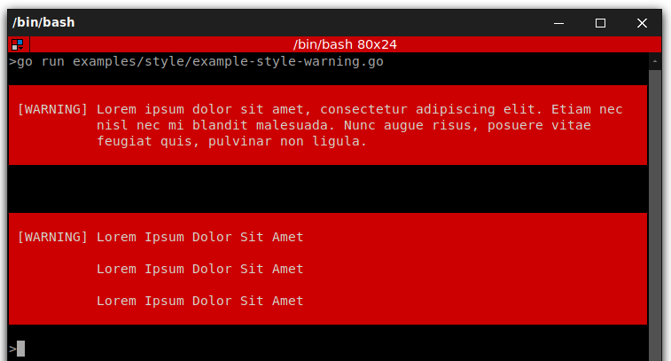
</p>

#### error()

It displays the given string or array of strings highlighted as an error message (with a red background and the \[ERROR]
label). It's meant to be used once to display the final result of executing the given command, but you can use it
repeatedly during the execution of the command:

```go
// use simple strings for short messages
io.Error("Lorem Ipsum Dolor Sit Amet, [...]")

// consider using arrays when displaying long messages
io.ErrorArray([]string{
"Lorem Ipsum Dolor Sit Amet",
"Lorem Ipsum Dolor Sit Amet",
"Lorem Ipsum Dolor Sit Amet",
})
```

<p align="center">
    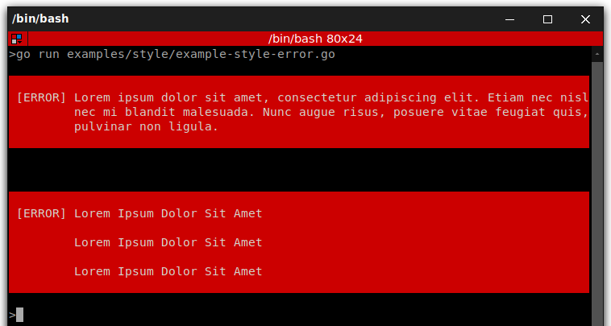
</p>

## How to Color the Console Output

Whenever you output text, you can use OutputInterface to surround the text with tags to color its output. For example:

### Predefined style tags

```go
package main

import "github.com/DrSmithFr/go-console/pkg/output"

func main() {
	// creating new output
	out := output.NewConsoleOutput(true, nil)

	// white text on a red background
	out.Writeln("<error>An error</error>")

	// green text
	out.Writeln("<info>An information</info>")

	// yellow text
	out.Writeln("<comment>An comment</comment>")

	// black text on a cyan background
	out.Writeln("<question>A question</question>")

	// underscore text
	out.Writeln("<u>Some underscore text</u>")

	// bold text
	out.Writeln("<b>Some bold text</b>")
}
```

<p align="center">
    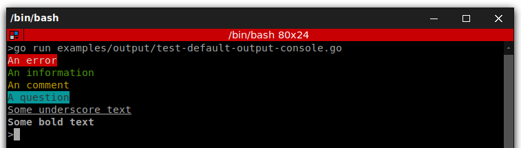
</p>

> The closing tag can be replaced by </>, which revokes all formatting options established by the last opened tag.

---

### Generic style tags

You can also set these colors and options directly inside the tag name:

```go
package main

import "github.com/DrSmithFr/go-console/pkg/output"

func main() {
	// green text
	out := output.NewConsoleOutput(true, nil)

	// black text on a cyan background
	out.Writeln("<fg=green>foo</>")

	// green text
	out.Writeln("<fg=black;bg=cyan>foo</>")

	// bold text on a yellow background
	out.Writeln("<bg=yellow;options=bold>foo</>")

	// bold text with underscore
	out.Writeln("<options=bold,underscore>foo</>")
}
```

<p align="center">
    
</p>

> If you need to render a tag literally, escape it with a backslash: \<info> or use the escape() method to escape all
> the tags included in the given string.

---

### Custom color tags

It is possible to define your own styles using the OutputFormatterStyle

```go
package main

import (
	"github.com/DrSmithFr/go-console/pkg/color"
	"github.com/DrSmithFr/go-console/pkg/formatter"
	"github.com/DrSmithFr/go-console/pkg/output"
)

func main() {
	// creating new output
	out := output.NewConsoleOutput(true, nil)

	// create new style
	s := formatter.NewOutputFormatterStyle(color.RED, color.YELLOW, []string{color.BOLD, color.BLINK})

	// add style to formatter
	out.GetFormatter().SetStyle("fire", *s)

	// use the new style
	out.Writeln("<fire>foo</>")
}
```

<p align="center">
    
</p>

> Available foreground and background colors are: black, red, green, yellow, blue, magenta, cyan and white.
> And available options are: bold, underscore, blink, reverse (enables the "reverse video" mode where the background and
> foreground colors are swapped) and conceal (sets the foreground color to transparent, making the typed text invisible -
> although it can be selected and copied; this option is commonly used when asking the user to type sensitive
> information).

---

By using colors in the command output, you can distinguish different types of output (e.g. important messages, titles,
comments, etc.).

```go
package main

import (
	"fmt"
	"github.com/DrSmithFr/go-console/pkg/color"
	"github.com/DrSmithFr/go-console/pkg/formatter"
)

func main() {
	// create a default style
	s1 := formatter.NewOutputFormatterStyle(color.NULL, color.NULL, nil)
	fmt.Printf(s1.Apply("some text without coloration\n"))

	s1.SetBackground(color.RED)
	fmt.Printf(s1.Apply("some text with red background\n"))

	s1.SetForeground(color.GREEN)
	fmt.Printf(s1.Apply("some text with red background and green text\n"))

	s1.SetOption(color.BOLD)
	fmt.Printf(s1.Apply("some bold text with red background and green text \n"))

	// override all options in one time
	s1.SetOptions([]string{color.UNDERSCORE})
	fmt.Printf(s1.Apply("some underscore text with red background and green text \n"))

	// quick declaration
	s2 := formatter.NewOutputFormatterStyle(color.BLUE, color.YELLOW, nil)
	fmt.Printf(s2.Apply("some text with yellow background and blue text\n"))

	// quick declaration with options
	s3 := formatter.NewOutputFormatterStyle(color.DEFAULT, color.DEFAULT, []string{color.UNDERSCORE, color.BOLD})
	fmt.Printf(s3.Apply("some bold and underscore text\n"))
}
```

<p align="center">
    
</p>

> The OutputFormatterStyle is the simplest way to color output. It is not mean to be use directly, but to defined custom
> tags used by OutputFormatterInterface.

---

[Return to Table of content](#tables-of-contents)

---

# How to use verbosity levels

Console commands have different verbosity levels, which determine the messages displayed in their output.
By default, commands display only the most useful messages,
but you can control their verbosity with the `--quiet|-q`, `--verbose|-v`, `--very-verbose|-vv`, `--debug|-vvv` options.

## Basic Usage

```go
package main

import (
	"github.com/DrSmithFr/go-console/pkg/input"
	"github.com/DrSmithFr/go-console/pkg/output"
	"github.com/DrSmithFr/go-console/pkg/style"
	"github.com/DrSmithFr/go-console/pkg/verbosity"
)

func main() {
	io := style.NewConsoleCommand()

	if io.GetVerbosity() == verbosity.Verbose {
		io.Text("Lorem Ipsum Dolor Sit Amet")
	}

	// available methods: .IsQuiet(), .IsVerbose(), .IsVeryVerbose(), .IsDebug()
	if io.IsVeryVerbose() {
		io.Text("Lorem Ipsum Dolor Sit Amet")
	}

	// or using directly the output instance
	out := io.GetOutput()

	if out.GetVerbosity() == verbosity.Verbose {
		out.Writeln("Lorem Ipsum Dolor Sit Amet")
	}

	// available methods: .IsQuiet(), .IsVerbose(), .IsVeryVerbose(), .IsDebug()
	if out.IsVeryVerbose() {
		out.Writeln("Lorem Ipsum Dolor Sit Amet")
	}
}
```

When the quiet level is used, all output is suppressed as the default write() method returns without actually printing.

---

[Return to Table of content](#tables-of-contents)

---

# How to ask for user input

The QuestionHelper provides functions to ask the user for more information.
It can be used to ask for confirmation, to ask for a value, or to ask for a choice.

## Helper Usage

The Question Helper needs an io.Reader instance as the first argument and OutputInterface instance as the second
argument.

```go
package main

import (
	"github.com/DrSmithFr/go-console/pkg/question"
	"github.com/DrSmithFr/go-console/pkg/style"
	"os"
)

func main() {
	io := style.NewConsoleCommand().Build()
	qh := question.NewHelper(os.Stdin, io.GetOutput())
}
```

## Asking the User for Information

The Question Helper has a single method ask() that takes a Question instance as its first argument and returns the
user's answer as a string.

```go
package main

import (
	"github.com/DrSmithFr/go-console/pkg/question"
	"github.com/DrSmithFr/go-console/pkg/question/answers"
	"github.com/DrSmithFr/go-console/pkg/style"
	"os"
)

func main() {
	io := style.NewConsoleCommand().Build()
	qh := question.NewHelper(os.Stdin, io.GetOutput())

	// Simple question with default answer
	name := qh.Ask(
		question.
			NewQuestion("What is your name?").
			SetDefaultAnswer("John Doe"),
	)
	io.Text("Hello " + name)
}
```

The user will be asked "What is your name?".
They can type some name which will be returned by the ask() method.

<p align="center">
    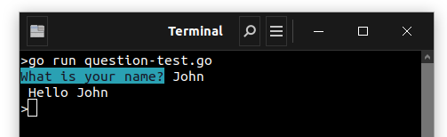
</p>

If they leave it empty, the default value ("John Doe" here) is returned.

<p align="center">
    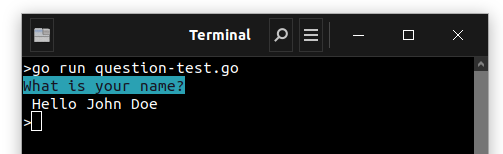
</p>

### Hiding the User's Response

You can also ask a question and hide the response. This is particularly convenient for passwords:

```go
package main

import (
	"github.com/DrSmithFr/go-console/pkg/question"
	"github.com/DrSmithFr/go-console/pkg/style"
	"os"
)

func main() {
	io := style.NewConsoleCommand().Build()
	qh := question.NewHelper(os.Stdin, io.GetOutput())

	// Simple question with hidden answer
	pass := qh.Ask(
		question.
			NewQuestion("What is your password?").
			SetHidden(true),
	)
	io.Text("Password: " + pass)
}
```

<p align="center">
    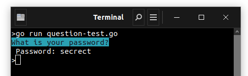
</p>

## Asking the User for Confirmation

Suppose you want to confirm an action before actually executing it. Add the following to your command:

```go
package main

import (
	"github.com/DrSmithFr/go-console/pkg/question"
	"github.com/DrSmithFr/go-console/pkg/question/answers"
	"github.com/DrSmithFr/go-console/pkg/style"
	"os"
)

func main() {
	io := style.NewConsoleCommand().Build()
	qh := question.NewHelper(os.Stdin, io.GetOutput())

	// Simple confirmation question
	answer := qh.Ask(
		question.
			NewComfirmation("Continue with this action?").
			SetDefaultAnswer(answers.YES).
			SetMaxAttempts(2),
	)
	if answer == answers.YES {
		io.Text("Great!")
	} else {
		io.Text("... ok :(")
	}
}
```

In this case, the user will be asked "Continue with this action?". If the user answers with y it returns "
yes" (`answers.YES`) or "no" (`answers.NO`) if they answer with n.
The default value to return if the user doesn't enter any valid input can be modify using the `SetDefaultAnswer()` (By
default it is set to `answers.NONE` forcing the user to answer).

<p align="center">
    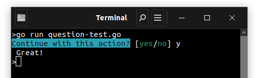
</p>

> **Note**
>
> > You can customize the regex used to check if the answer means "yes" using the `SetYesRegex()` method. (By default it
> > is set to `^(y|yes|true|1)$`)
>
> > You can customize the regex used to check if the answer means "no" using the `SetNoRegex()` method. (By default it
> > is set to `^(n|no|false|0)$`)
>
> > You can define your own error message using `SetErrorMessage()`
> > by default it is set to `"Value '%s' is invalid"`

## Asking the User for a Choice

If you have a predefined set of answers the user can choose from, you could use a ChoiceQuestion which makes sure that
the user can only enter a valid string from a predefined list:

```go
package main

import (
	"github.com/DrSmithFr/go-console/pkg/question"
	"github.com/DrSmithFr/go-console/pkg/question/answers"
	"github.com/DrSmithFr/go-console/pkg/style"
	"os"
)

func main() {
	io := style.NewConsoleCommand().Build()
	qh := question.NewHelper(os.Stdin, io.GetOutput())

	colors := []string{"red", "green", "blue", "yellow", "black", "white"}

	// Choice question with only one answer allowed
	answer := qh.Ask(
		question.
			NewChoices("What is your overall favorite color?", colors).
			SetMaxAttempts(3),
	)

	io.Text("Your overall favorite color is " + answer)
}
```

<p align="center">
    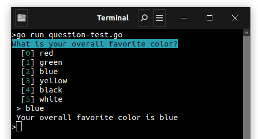
</p>

If the user enters an invalid or empty string, an error message is shown and the user is asked to provide the answer
another time,
until they enter a valid string or reach the maximum number of attempts.

<p align="center">
    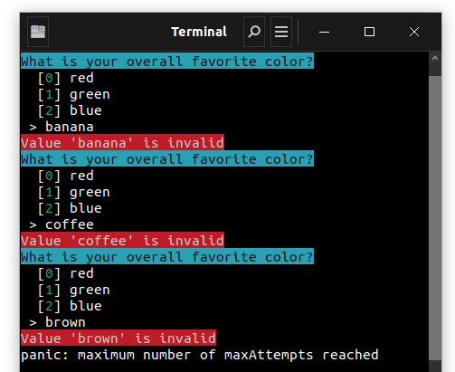
</p>

> **Note**
> > The default value for the maximum number of attempts is 0. which means an infinite number of attempts.
>
> > You can define your own error message using `SetErrorMessage()`
> by default it is set to `"Value '%s' is invalid"`

## Multiple Choices

Sometimes, multiple answers can be given. The ChoiceQuestion provides this feature using comma separated values.
This is disabled by default, to enable this use `SetMultiselect(true)`:

```go
package main

import (
	"github.com/DrSmithFr/go-console/pkg/question"
	"github.com/DrSmithFr/go-console/pkg/style"
	"os"
	"strings"
)

func main() {
	io := style.NewConsoleCommand().Build()
	qh := question.NewHelper(os.Stdin, io.GetOutput())

	colorList := []string{"red", "green", "blue", "yellow", "black", "white"}

	// Choice question with multiple answers allowed
	answer := qh.Ask(
		question.
			NewChoices("What is your favorite color?", colorList).
			SetMultiselect(true).
			SetMaxAttempts(3),
	)

	// Retrieve all selected colors by splitting the answer on commas
	colors := strings.Split(answer, ",")

	for _, color := range colors {
		io.Text("One of your favorite color is " + color)
	}
}
```

<p align="center">
    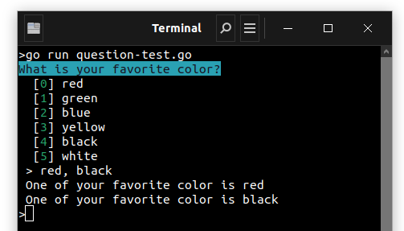
</p>

## Normalizing the Answer

Before validating the answer, you can "normalize" it to fix minor errors or tweak it as needed.
For instance, in the next example you ask for the user firstname. In case the user did capitalize the first error by
mistake,
you can modify the answer provided before validating it. To do so, configure a normalizer using the `SetNormalizer()`
method:

```go
package main

import (
	"github.com/DrSmithFr/go-console/pkg/question"
	"github.com/DrSmithFr/go-console/pkg/style"
	"golang.org/x/text/cases"
	"golang.org/x/text/language"
	"os"
)

func main() {
	io := style.NewConsoleCommand().Build()
	qh := question.NewHelper(os.Stdin, io.GetOutput())

	// Simple question with normalizer
	firstname := qh.Ask(
		question.
			NewQuestion("What is your name?").
			SetNormalizer(func(answer string) string {
				return cases.Title(language.English, cases.Compact).String(answer)
			}),
	)
	io.Text("Hello " + firstname)
}
```

<p align="center">
    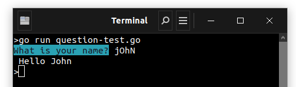
</p>

> **Note**
>
> > Adding a custom normalizer on QuestionConfirmation and QuestionChoices will override the default one.
> > If you want to keep the default behaviour and add your own logic before or after, see the next section about
> > ChainNormalizer.
>
> > The normalizer is called first and the returned value is used as the input of the validator.
> > If the answer is invalid, don't throw exceptions in the normalizer and let the validator handle those errors.

### The ChainNormalizer

The `MakeChainNormalizer` allows you to merge multiple normalizers. Each normalizer will be called in the order they are
defined.

```go
package main

import (
	"github.com/DrSmithFr/go-console/pkg/question"
	"github.com/DrSmithFr/go-console/pkg/question/normalizer"
	"github.com/DrSmithFr/go-console/pkg/style"
	"os"
	"strings"
)

func main() {
	io := style.NewConsoleCommand().Build()
	qh := question.NewHelper(os.Stdin, io.GetOutput())

	// Simple question with normalizer
	firstname := qh.Ask(
		question.
			NewQuestion("What is your name?").
			SetNormalizer(
				normalizer.MakeChainedNormalizer(
					strings.ToLower,
					normalizer.Ucfirst,
					func(answer string) string {
						return answer + "!"
					},
				),
			),
	)
	io.Text("Hello " + firstname)
}
```

<p align="center">
    
</p>

> **Note**
>
> > a normalizer is a function that takes a string as input and returns a string as output.
> > That means you can use any function that respects this signature, from the standard library to your own functions.

With the same logic, you can encapsulate the default normalizer using the `MakeChainNormalizer` method,
however, you will need to pass the question as a parameter of `normalizer.DefaultChoicesNormalizer()`.

```go
package main

import (
	"github.com/DrSmithFr/go-console/pkg/question"
	"github.com/DrSmithFr/go-console/pkg/question/normalizer"
	"strings"
)

func main() {
	// chain normalizer example using including the default normalizer
	q := question.
		NewChoices("What is your favorite color?", []string{"red", "blue", "yellow"}).
		SetMultiselect(true).
		SetMaxAttempts(3)

	customNormalizer := normalizer.
		MakeChainedNormalizer(
			strings.ToLower,
			q.GetDefaultNormalizer(),
			normalizer.Ucfirst,
			func(answer string) string {
				return answer + "!"
			},
		)

	q.SetNormalizer(customNormalizer)
}
```

## Validating the Answer

You can even validate the answer. you can configure a validator using the `SetValidator()` method:

```go
package main

import (
	"errors"
	"github.com/DrSmithFr/go-console/pkg/question"
	"github.com/DrSmithFr/go-console/pkg/style"
	"os"
	"regexp"
)

func main() {
	io := style.NewConsoleCommand().Build()
	qh := question.NewHelper(os.Stdin, io.GetOutput())

	// Simple question with custom validator
	nickname := qh.Ask(
		question.
			NewQuestion("What is your nickname?").
			SetValidator(func(answer string) error {
				regex := regexp.MustCompile("^(\\w|_|-)*$")
				if match := regex.MatchString(answer); !match {
					return errors.New("nickname must be alphanumeric")
				}

				return nil
			}),
	)
	io.Text("Hi " + nickname)
}
```

It should return an error if there is something wrong.
The error message is displayed in the console, so it is a good practice to put some useful information in it.

<p align="center">
    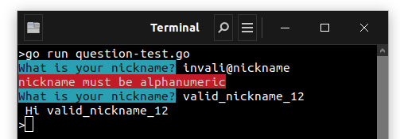
</p>

> **Note**
>
> > Adding a custom validator on QuestionConfirmation and QuestionChoices will override the default one.
> > If you want to keep the default behaviour and add your own logic before or after, see the next section about
> > ChainedValidator.

### The ChainedValidator

The `MakeChainedValidator` allows you to merge multiple validators.
Each validator will be called in the order they are defined.

```go
package main

import (
	"errors"
	"github.com/DrSmithFr/go-console/pkg/question"
	"github.com/DrSmithFr/go-console/pkg/style"
	"github.com/DrSmithFr/go-console/pkg/question/validator"
	"os"
)

func main() {
	io := style.NewConsoleCommand().Build()
	qh := question.NewHelper(os.Stdin, io.GetOutput())

	// chain validator example
	answer := qh.Ask(
		question.
			NewQuestion("What is your favorite color?").
			SetValidator(
				validator.
					MakeChainedValidator(
						func(answer string) error {
							if answer == "red" {
								return errors.New("red is mine")
							}

							return nil
						},
						func(answer string) error {
							if answer == "blue" {
								return errors.New("blue is disgusting")
							}

							return nil
						},
					),
			),
	)
	io.Text(answer)
}
```

<p align="center">
    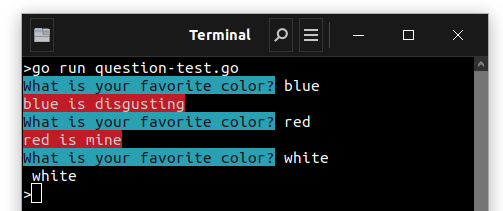
</p>

---

[Return to Table of content](#tables-of-contents)

---

# How to display tables in the console

When building a console application it may be useful to display tabular data:

<p align="center">
    
</p>

## Basic Usage

To display a table, use Table, set the headers, set the rows and then render the table:

```go
package main

import (
	"github.com/DrSmithFr/go-console/pkg/style"
	"github.com/DrSmithFr/go-console/pkg/table"
)

func main() {
	io := style.NewConsoleCommand().Build()

	tab := table.
		NewTable().
		AddHeadersFromString(
			[][]string{
				{"ISBN-LONG-TITLE", "Title", "Author"},
			},
		)

	tab.
		AddRowsFromString(
			[][]string{
				{"99921-58-10-7", "The Divine Comedy", "Dante Alighieri"},
				{"9971-5-0210-0", "A Tale of Two Cities", "Charles Dickens"},
				{"960-425-059-0", "The Lord of the Rings", "J. R. R. Tolkien"},
				{"80-902734-1-6", "And Then There Were None", "Agatha Christie"},
			},
		)

	render := table.
		NewRender(io.GetOutput()).
		SetContent(tab)

	render.Render()
}
```

You can add a table separator anywhere in the output by passing an instance of TableSeparator as a row:

```go
  tab.
AddRowsFromString(
[][]string{
{"99921-58-10-7", "The Divine Comedy", "Dante Alighieri"},
{"9971-5-0210-0", "A Tale of Two Cities", "Charles Dickens"},
{"---"}, // or "===" 
{"960-425-059-0", "The Lord of the Rings", "J. R. R. Tolkien"},
{"80-902734-1-6", "And Then There Were None", "Agatha Christie"},
},
)
```

<p align="center">
    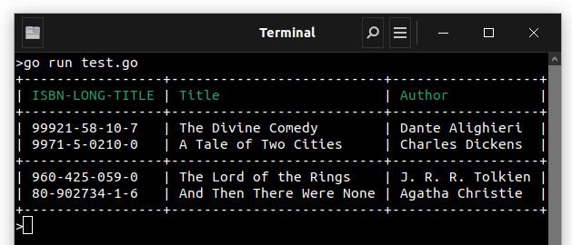
</p>

You can optionally display titles at the top and the bottom of the table:

```go
  tab.
SetHeaderTitle("Books").
SetFooterTitle("Page 1/2")
```

<p align="center">
    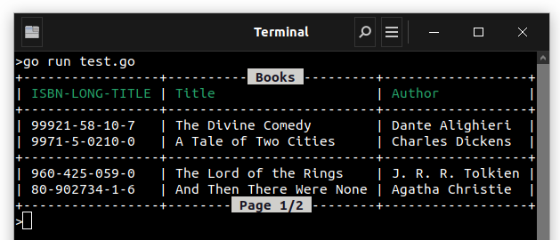
</p>

By default, the width of the columns is calculated automatically based on their contents.
Use the SetColumnWidths() method to set the column widths explicitly:

```go
    // this is equivalent to the calling SetColumnsMinWidths() and SetColumnsMaxWidths() with the same values
render.
SetColumnsWidths(map[int]int{
0: 10,
1: 0,
2: 30,
})
render.Render()
```

In this example, the first column width will be 10,
the last column width will be 30 and the second column width will be calculated automatically because of the 0 value.

You can also set the width individually for each column with the SetColumnWidth() method.
Its first argument is the column index (starting from 0) and the second argument is the column width:

```go
    render.SetColumnWidth(0, 10)
render.SetColumnWidth(2, 10)

render.Render()
```

The output of this command will be:

<p align="center">
    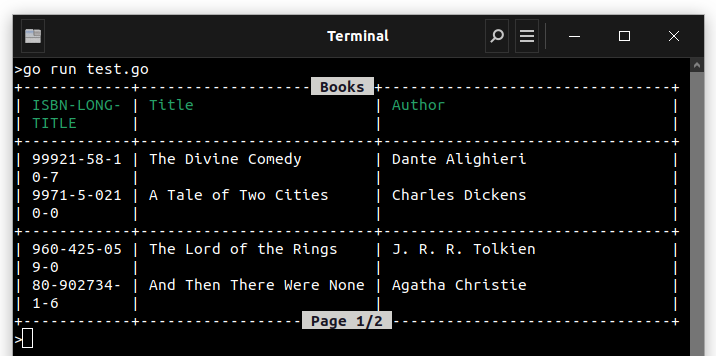
</p>

Note that you can also set the max and min width of a column individually:

```go
    render.SetColumnMaxWidth(0, 10)
render.SetColumnMinWidth(1, 15)

render.
SetColumnsMinWidths(map[int]int{
0: 10,
1: 0,
2: 30,
})

render.
SetColumnsMaxWidths(map[int]int{
0: 10,
1: 0,
2: 30,
})

render.Render()
```

## Table Styling

The table style can be changed to any built-in styles via SetStyleFromName()

```go
    // same as calling nothing
render.SetStyleFromName("default")

// changes the default style to compact
render.SetStyleFromName("compact")
render.Render()
```

This code results in:

<p align="center">
    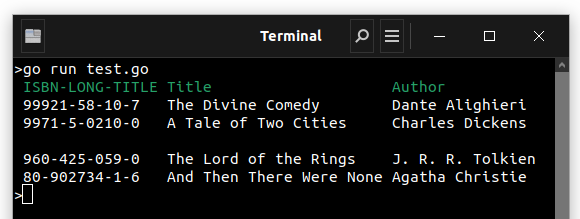
</p>

You can also set the style to `borderless`:

```go
    // changes the default style to compact
render.SetStyleFromName("borderless")
render.Render()
```

<p align="center">
    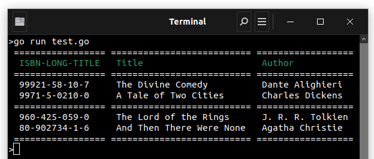
</p>

You can also set the style to `box`:

```go
    // changes the default style to compact
render.SetStyleFromName("box")
render.Render()
```

<p align="center">
    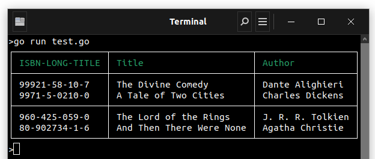
</p>

You can also set the style to `box-double`:

```go
    // changes the default style to compact
render.SetStyleFromName("box-double")
render.Render()
```

<p align="center">
    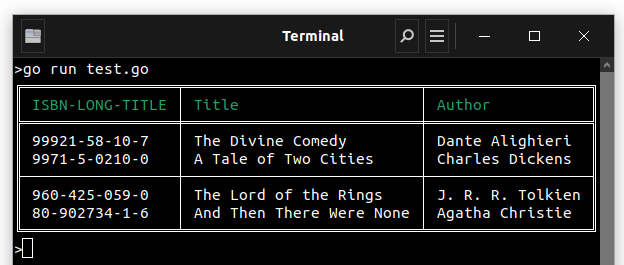
</p>

> **Note:**
>
> > Using shortcut "---" and "===" to insert a tableSeparator with style `box-double`
> > will result in simple or double line separator.
> > On every other style, it will result in a simple line separator.

If the built-in styles do not fit your need, define your own:

```go
    customStyle := table.NewTableStyle().
SetHorizontalOutsideBorderChar("═").
SetHorizontalInsideBorderChar("─").
SetVerticalOutsideBorderChar("║").
SetVerticalInsideBorderChar("│").
SetCrossingChars("┼", "╔", "╤", "╗", "╢", "╝", "╧", "╚", "╟", "╠", "╪", "╣")

render.SetStyle(customStyle)
```

## Spanning Multiple Columns

To make a table cell that spans multiple columns you can use a TableCell:

```go
    package main

import (
	"github.com/DrSmithFr/go-console/pkg/style"
	"github.com/DrSmithFr/go-console/pkg/table"
)

func main() {
	io := style.NewConsoleCommand().Build()

	tab := table.
		NewTable().
		AddHeadersFromString(
			[][]string{
				{"ISBN-LONG-TITLE", "Title", "Author"},
			},
		)

	tab.
		AddRowsFromString(
			[][]string{
				{"99921-58-10-7", "The Divine Comedy", "Dante Alighieri"},
				{"9971-5-0210-0", "A Tale of Two Cities", "Charles Dickens"},
				{"---"},
				{"960-425-059-0", "The Lord of the Rings", "J. R. R. Tolkien"},
				{"80-902734-1-6", "And Then There Were None", "Agatha Christie"},
				{"==="},
			},
		).
		AddRow(
			&table.TableRow{
				Columns: map[int]table.TableColumnInterface{
					0: &table.TableColumn{
						Cell: &table.TableCell{
							Value:   "<info>This value spans use <b>3 columns</b> to get fully displayed and now to long to feet inside the table.</info>",
							Colspan: 3,
							PadType: table.PadToCenter,
						},
					},
				},
			},
		)

	render := table.
		NewRender(io.GetOutput()).
		SetContent(tab)

	render.SetStyleFromName("box-double")

	render.Render()
}
```

This results in:

<p align="center">
    
</p>

> **Note:**
>
> > You can create a title using a header cell that spans the entire table width.

## Padding management

You can set the padding type for each cell or column individually:

- `PadToLeft` (default)
- `PadToCenter`
- `PadToRight`

> **Note:**
>
> > If you set a cell padding, the column padding will be ignored.
>
> > If you set a column padding, the default padding (defined by style) will be ignored.

```go
    package main

import (
	"github.com/DrSmithFr/go-console/pkg/style"
	"github.com/DrSmithFr/go-console/pkg/table"
)

func main() {
	io := style.NewConsoleCommand().Build()

	tab := table.
		NewTable().
		SetColumnPadding(3, table.PadToRight).
		AddHeader(
			&table.TableRow{
				Columns: map[int]table.TableColumnInterface{
					0: &table.TableColumn{
						Cell: &table.TableCell{
							Value:   "Centred Header Cell",
							Colspan: 3,
							PadType: table.PadToCenter,
						},
					},
				},
			},
		).
		AddRow(
			table.
				NewTableRow().
				AddColumn(
					table.
						NewTableColumn().
						SetCell(
							table.
								NewTableCell("This value spans 2 columns.").
								SetPadType(table.PadToCenter).
								SetColspan(2),
						),
				).
				AddColumn(
					table.
						NewTableColumn().
						SetCell(
							table.
								NewTableCell("stand alone value"),
						),
				),
		).
		AddTableSeparator().
		AddRowsFromString(
			[][]string{
				{"960-425-059-0", "The Lord of the Rings", "J. R. R. Tolkien"},
				{"80-902734-1-6", "And Then There Were None", "Agatha Christie"},
			},
		)

	render := table.
		NewRender(io.GetOutput()).
		SetContent(tab)

	render.SetColumnMinWidth(2, 13)

	render.SetStyleFromName("box-double")

	render.Render()
}
```

<p align="center">
    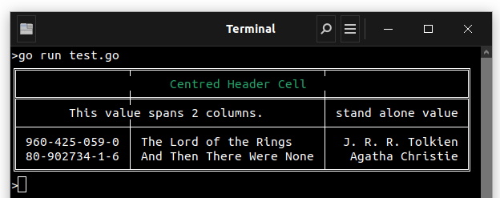
</p>

---

[Return to Table of content](#tables-of-contents)

---